# MindBridge App

MindBridge is a mobile application that uses a custom AI-driven mental health checker to detect presence of the different types of bipolar and depression and offers mental health services to users through access to mental health professionals through virtual video meetings on the app

## Backend
This mobile application is supported by a RESTful API backend built with Express.js availble here [MindBridge Backend](https://github.com/victor-nsengiyumva/mindBridge-backend)

## :sparkles: App Features

- Authentication
- AI-driven mental health checking
- Question based mental health analysis
- Searching for mental health expert
- Book and Pay for appointment with the expert
- Attend video session with expert on app
- Manage appointments
- View app services history

## :iphone: Screens

Landing Screen | Take Test Screen | Test Results Screen |
:------------:|:-----------:|:--------------:|
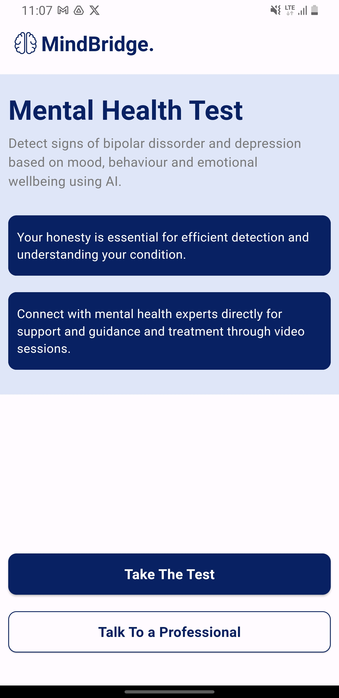 | 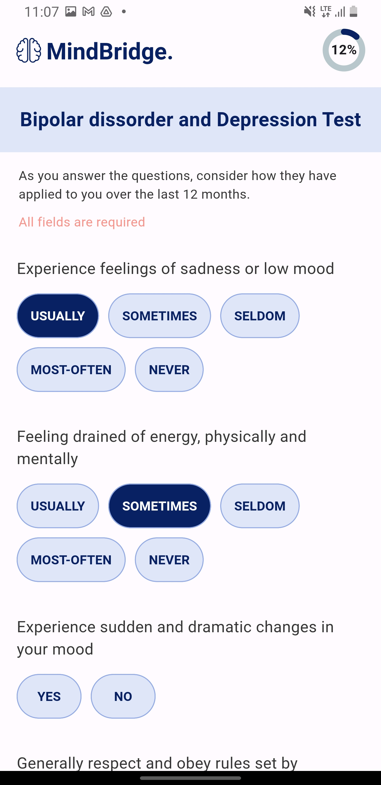 | 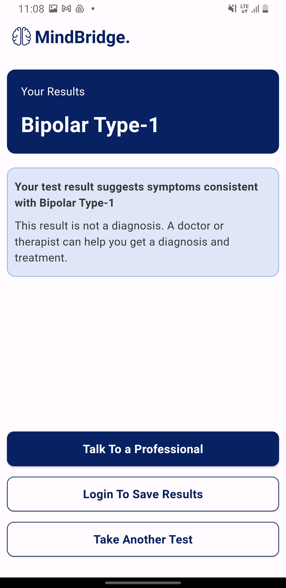
Select Doctor | Make Appointment | Process Payment |
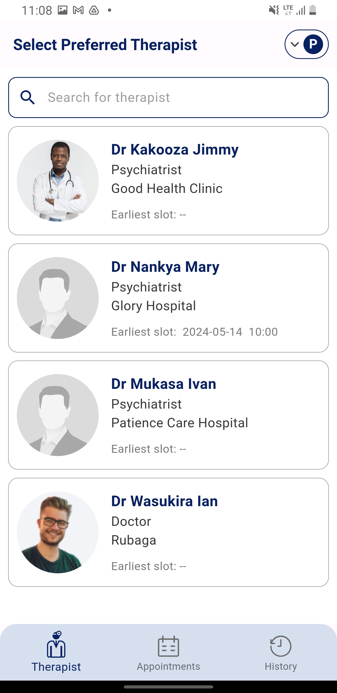 | 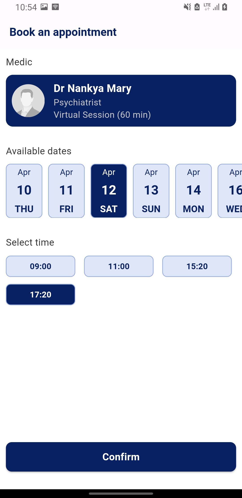 | 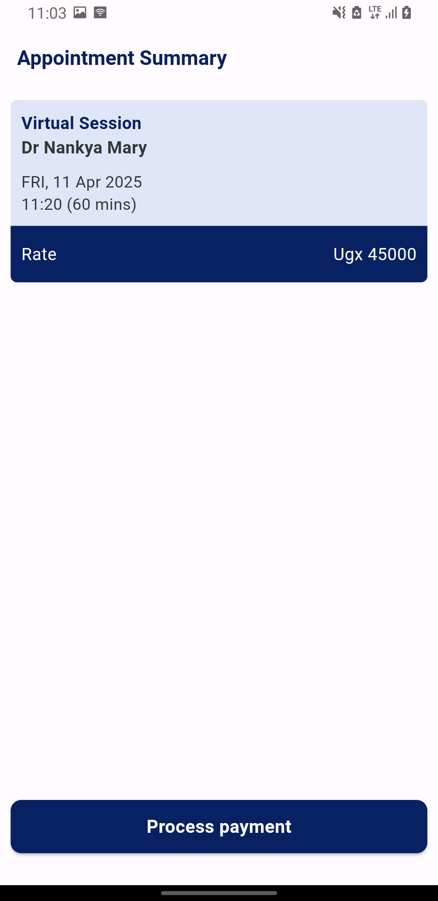
Successful Payment | Pending Appointments | Enter Call Id |
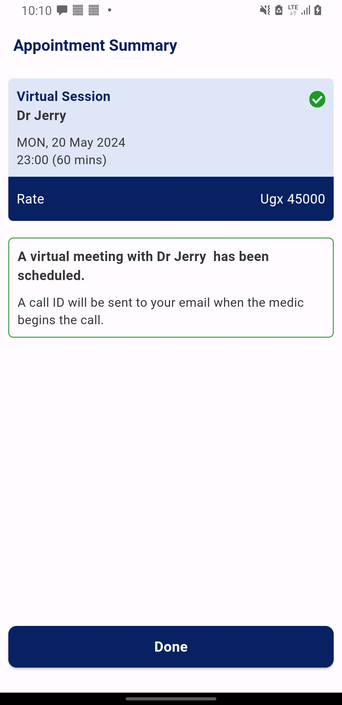 | 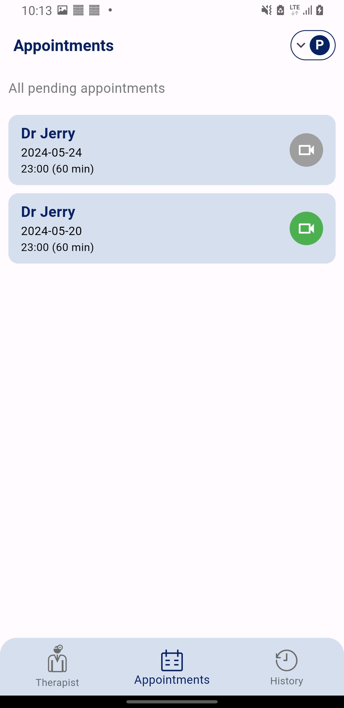 | 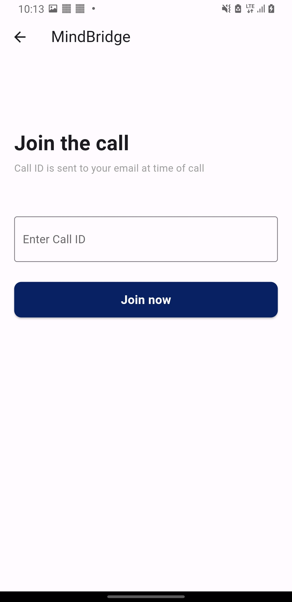
Video Session | Test History Screen | Test History Details |
 | 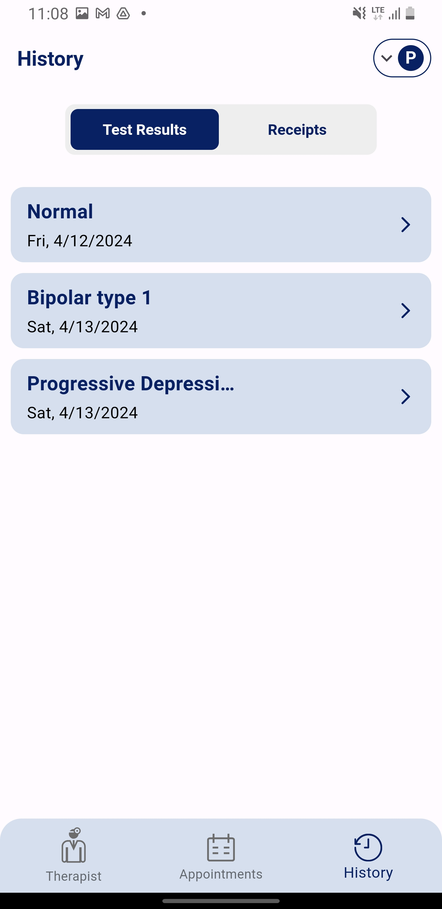 | 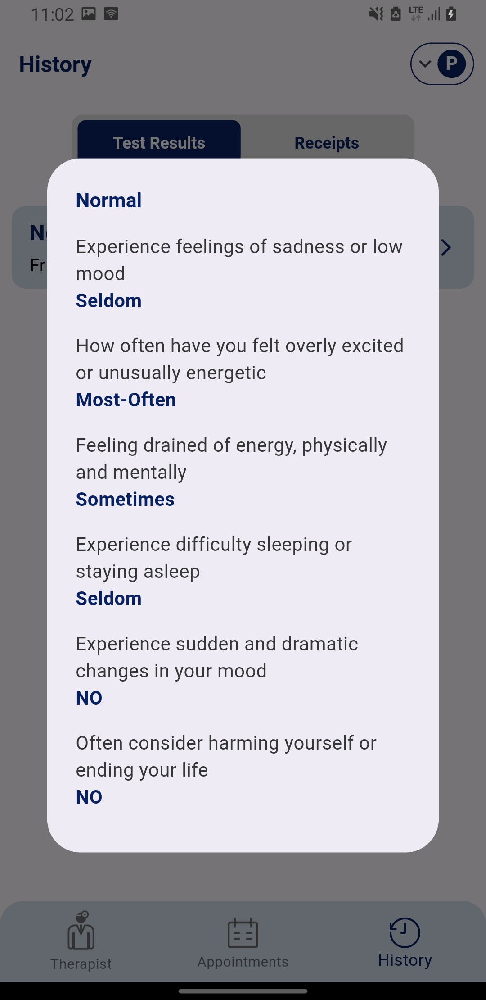
Doctor Details | Receipts Screen | User Profile |
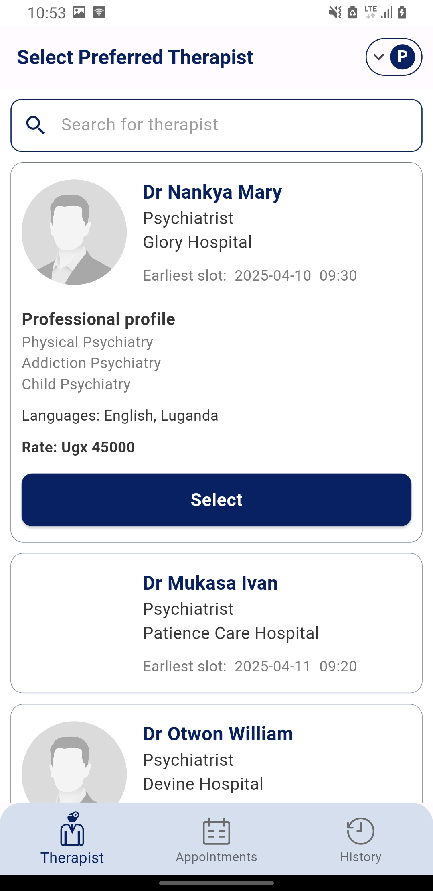 | 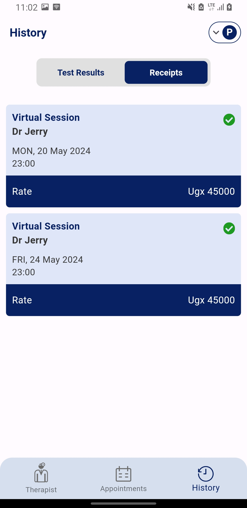 | 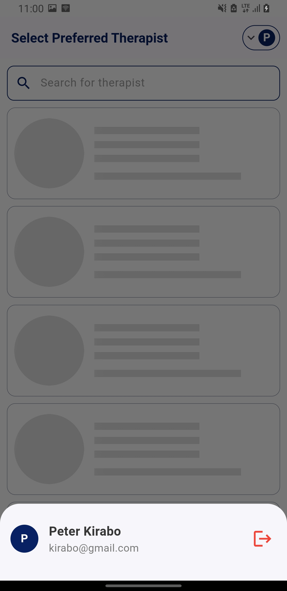
Loading State | Empty lists Screen | Network Error Screen |
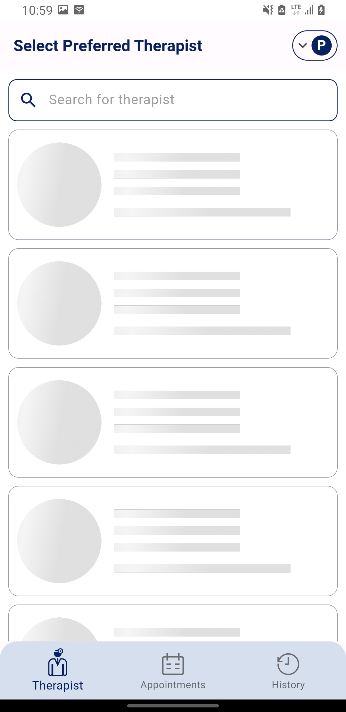 | 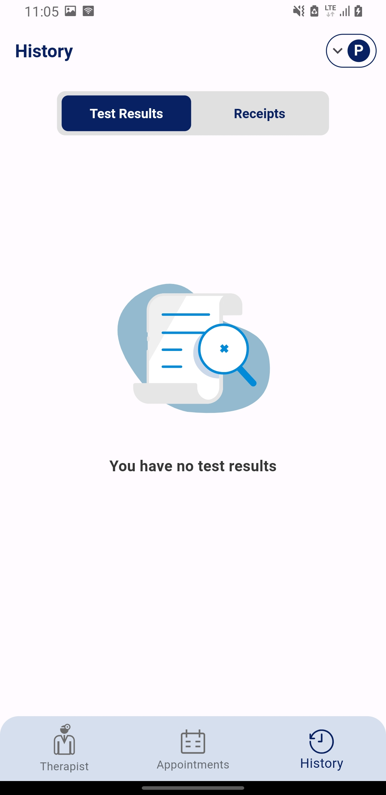 | 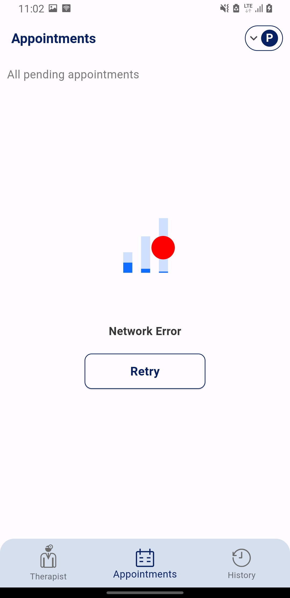

## 🚀 Technologies
- Flutter 3.19.3
- Dart 3.3.1
- SendGrid 
- videosdk 
